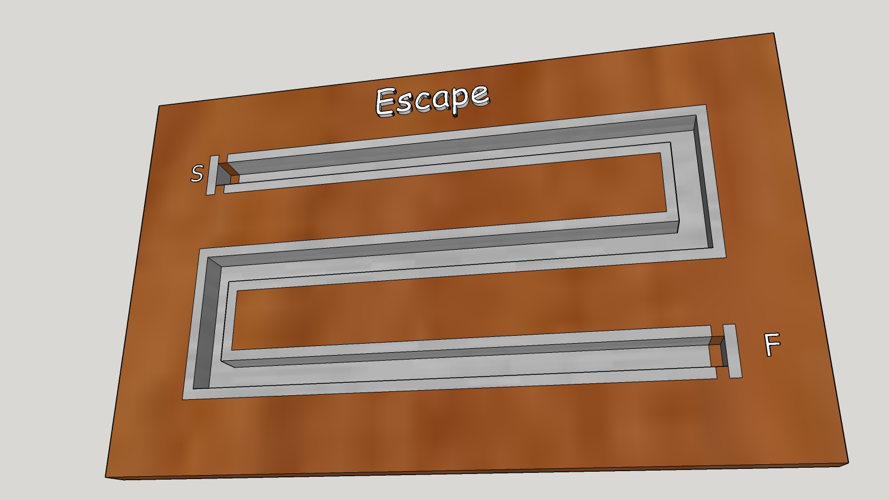

# Overview

A game with BrainPad board

# BrainPad development

 * [Board details](https://www.ghielectronics.com/support/brainpad)
 * [Getting started](https://www.ghielectronics.com/support/brainpad/duino)

# Sound Enabling

In order to enabe sound

 1. Right click on `EscapeGame` project
 2. Go to `Build` section
 3. Add `ENABLE_SOUND` to the end of `Conditional compilation symbols` separating by comma items

# Prototyping on Breadboard

 * Yellow button (Start) - E1
 * Red button (Loss) - E2
 * Green button (Finish) - E3
 * V5 - E15

# Game Board

[Sketchup Model](doc/Board.skp)

# Demo Video

